# INTRODUCTION

@GKX2020

[@IPCA]

@GKX2021

***

# MACHINE LEARNING AND DEEP LEARNING IN EMPIRICAL ASSET PRICING

***

## AP PROBLEM SETUP

![[@Cochrane_Discount_Rates]](images/image-20211020112100907.png)

![[@Cochrane_Discount_Rates]](images/image-20211020113057593.png)

![[@Cochrane_Discount_Rates]](images/cochrane_slides_discount_rates/Cochrane-2021-slides1-Discount Rates16.png)

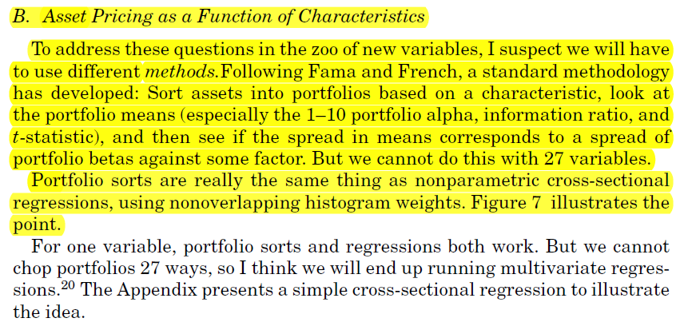

![[@Cochrane_Discount_Rates]](images/cochrane_slides_discount_rates/Cochrane-2021-slides1-Discount Rates14.png)

![[@Cochrane_Discount_Rates]](images/image-20211020113606479.png)

***

## ML AND DL VERSUS ECONOMIC RESTRICTIONS

***

## 	DISCOUNT RATES

From the American Finance Association, Presidential Address: Discount Rates [@Cochrane_Discount_Rates]

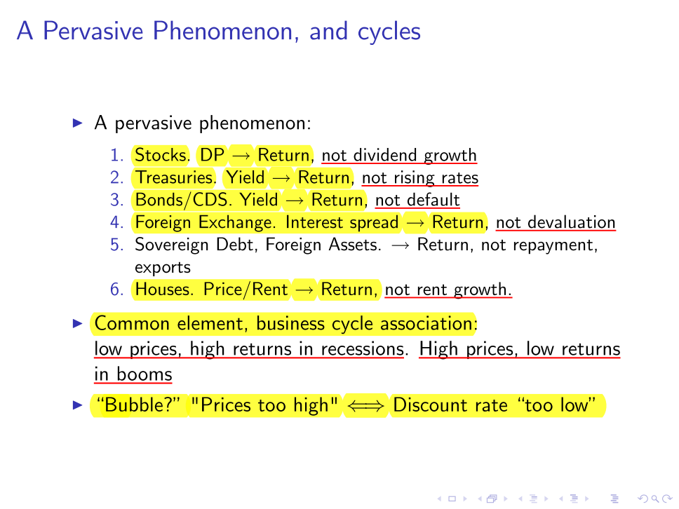

***

## MOTIVATIONS

***

### DIMENSIONALITY PROBLEM

***

### SPARSITY

***

### ZOO OF ANOMALIES

From @Cochrane_Discount_Rates_Slides

***

### SHORTCOMINGS OF TRADITIONAL METHODS

***

## GOALS

***

## FUTURE AGENDA

***

# ML AND DL CONCEPTS OVERVIEWS

In this chapter only the concepts relevant for Asset Pricing (AP) are discussed. For instance, the whole general class of classification problems or unsupervised learning are not treated as the goal in (AP) is to explain/predict prices and returns which are both continues variables instead of classes.

## MODEL SELECTION

***

### TERMINOLOGY

***

### INFORMATION CRITERIA

One approach to select the best model is to compare them using the information criteria

***

### STEPWISE SELECTION

***

### CROSS-VALIDATION (CV)

However the more robust solution is to use the Cross-validation (CV) approach

These series of slides are from Long Feng - SDSC 6001–Statistical Machine Learning, Spring 2020 - School of Data Science, City University of Hong Kong

***

#### K-FOLD CROSS-VALIDATION (K-CV) AND LEAVE-ONE OUT CROSS-VALIDATION (LOOCV)

 

***

#### BOOTSTRAP

***

***

### FORECAST COMBINATION

***

## MODEL VALIDATION

***

## LOSS FUNCTIONS

***

## MODEL PERFORMANCE COMPARISON

1. Out-of-Sample $R^2$
2. Diebold-Mariano (modified) test, model 1 vs model 2

# MODELS

In this chapter only the concepts relevant for Asset Pricing (AP) are discussed. For instance, the whole general class of classification problems or unsupervised learning are not treated as the goal in (AP) is to explain/predict prices and returns which are both continues variables instead of classes.

***

## ML

### LINEAR METHODS

***

####  PRINCIPAL COMPONENTS ANALYSIS (PCA)

N are the observations and P are the features. Geometrically the NxP matrix consists in N points in a P dimensional space. PCA reduces the dimensional space from P to K and represents the N obsrvations as points in this K dimensional space. The axes (space basis) of the P dimensional space are defined by the columns of the NxP matrix (each axis is a vector defined by N coordinates, therefore in a N dimensional space).

$V_{k}$ represents the loadings (k values shared by all the N observations) of the P dimensions on the k-th PCA dimension. It tells how to project the P dimensions onto the k-th PCA dimension

$Z_{k}$ is Nx1

EXAMPLE 1

EXAMPLE 2

***

##### KERNEL PCA

***

##### PRINCIPAL COMPONENTS REGRESSION (PCR)

***

###### KERNEL PCR

***

##### IPCA -  Instrumental Principal Component Analysis

***

#### PARTIAL LEAST SQUARES (PLS)

***

#### SHRINKCAGE METHODS

***

##### RIDGE REGRESSION

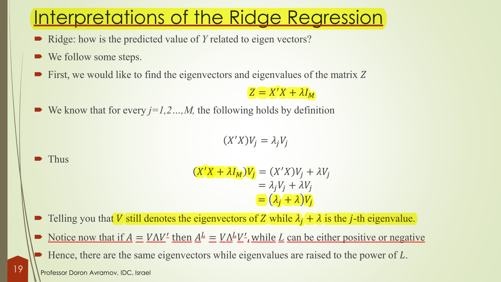

***

EXAMPLE

***

###### KERNEL RIDGE REGRESSION

***

##### LASSO - Least Absolute Shrinkage and Selection Operator

EXAMPLE

***

##### LEAST ANGLE REGRESSION

***

##### BRIDGE REGRESSION

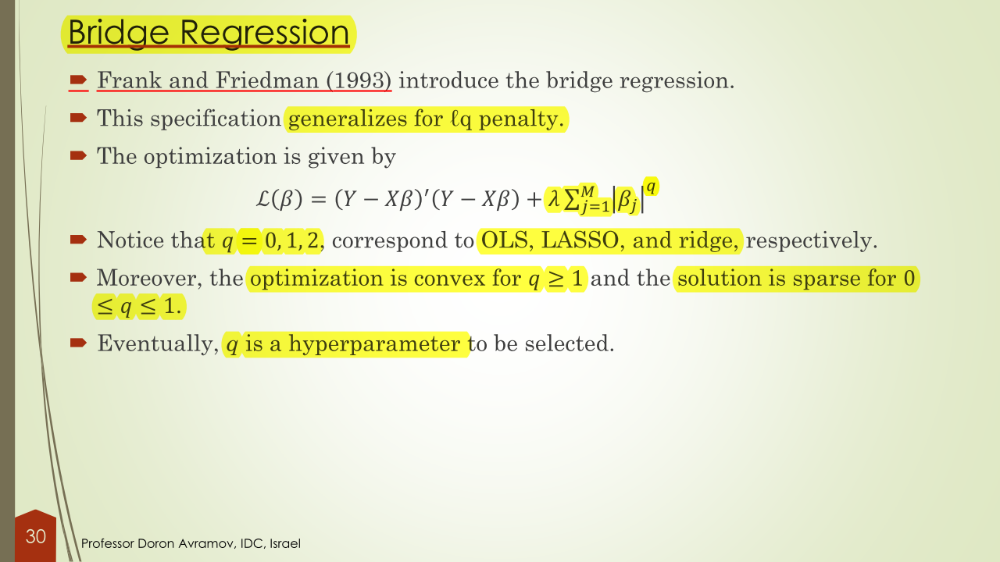

***

##### ELASTIC NET

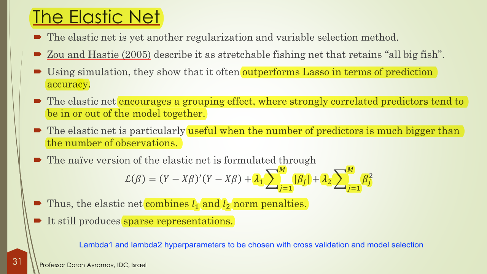

***
##### GROUP LASSO and SPARSE GROUP LASSO

***

##### FUSED LASSO

***

##### ADAPTIVE LASSO

***

##### CONCAVE PENALTIES (SCAD and MCP)

- SCAD: Smoothly Clipped Absolute Deviations

- MCP: Minmax Concave Penalty

  

***

##### SUPPORT VECTOR REGRESSION (SVR)

***

###### KERNEL SUPPORT VECTOR REGRESSION (KERNEL SVR)

***

### NONLINEAR METHODS

***

#### GENERALIZED LINEAR MODELS (GLM)

***

##### LINEAR SPLINES

***

##### CUBIC SPLINES

***

##### NATURAL CUBIC SPLINES

EXAMPLE

***

#### ADAPTIVE GROUP LASSO (with quadratic spline approximation)

#### REGRESSION TREES

These series of slides are from Long Feng - SDSC 6001–Statistical Machine Learning, Spring 2020 - School of Data Science, City University of Hong Kong

In this section only the regression tree are covered as the classification trees are usually not relevant in asset pricing since the studied dataset consists of asset prices or retursn which are indeed not classes but continues variables instead.

Example

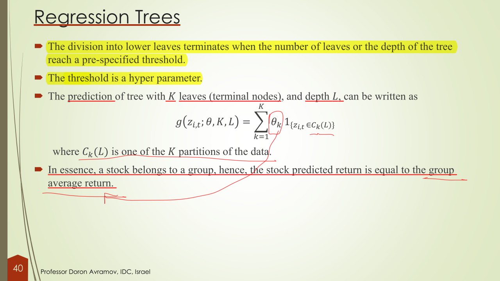

EXAMPLE

***

##### RANDOM TREES + BAGGING (BOOTSTRAPPING)

***

##### RANDOM TREES + BOOSTING (SHALLOW LEARNERS)

Boosting is superior than random forest

***

##### RANDOM FOREST

## DL

### NEURAL NETWORKS (GENERAL)

These series of slides are from Long Feng - SDSC 6001–Statistical Machine Learning, Spring 2020 - School of Data Science, City University of Hong Kong

***

#### ACTIVATION FUNCTIONS

***

#### OUTPUT FUNCTION

***

#### ESTIMATION

***

### FEED FORWARD NETWORKS (FFN)

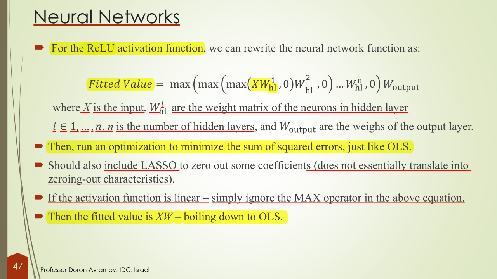

***

### SEQUENTIAL MODEL

***

#### RECURRENT NEURAL NETWORKS (RNN)

These series of slides are from Long Feng - SDSC 6001–Statistical Machine Learning, Spring 2020 - School of Data Science, City University of Hong Kong

 	

***

#### LSTM (Long Short Term Memory)

These series of slides are from Long Feng - SDSC 6001–Statistical Machine Learning, Spring 2020 - School of Data Science, City University of Hong Kong

***

### AUTOENCODER

The autoencoder networks are considere deep unsupervised learners. They represent the non-linear extension of the PCA.

These series of slides are from Long Feng - SDSC 6001–Statistical Machine Learning, Spring 2020 - School of Data Science, City University of Hong Kong

***

#### SPARSE AUTOENCODER

This section may not be relevant for Asset Pricing.

***

#### DENOISING AUTOENCODER

***

#### UNCONDITIONAL AUTOENCODER

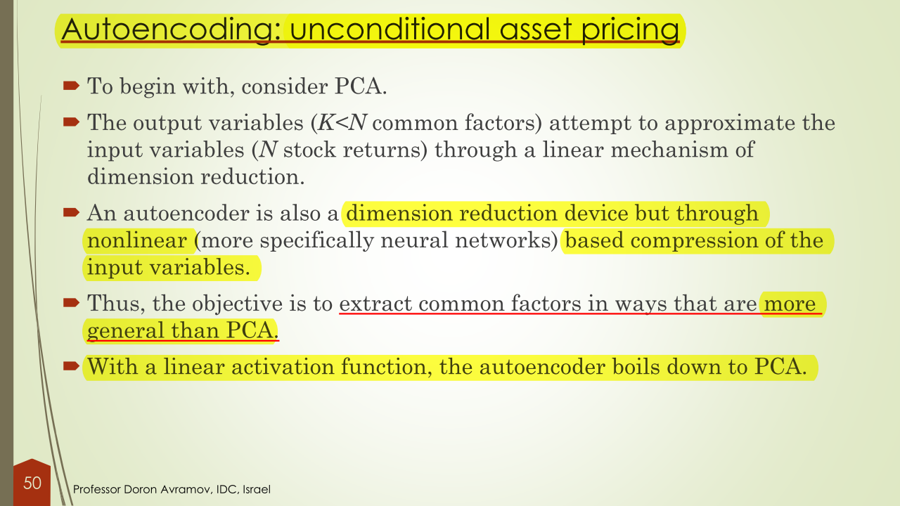

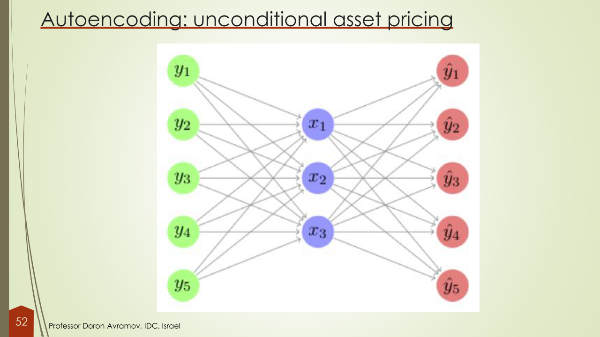

#### CONDITIONAL AUTOENCODER

### GAN (GENERATIVE ADVERSARIAL NEURAL NETWORK)

## REINFORCEMENT LEARNING: TRANSFORMER ENCODER + CAAN

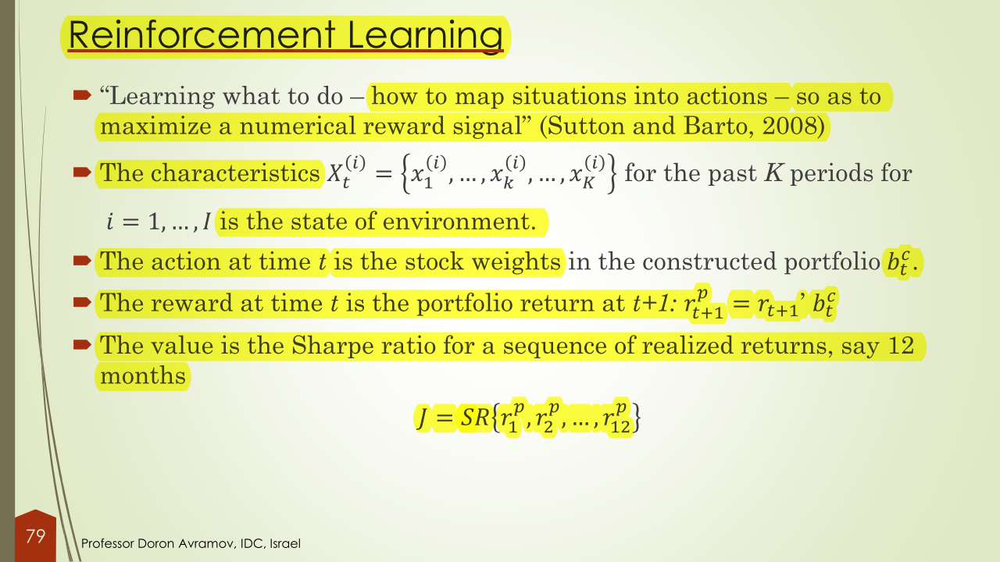

# RESEARCH IN ASSET PRICING WITH ML AND DL

## OVERVIEW AND RESULTS COMPARISON

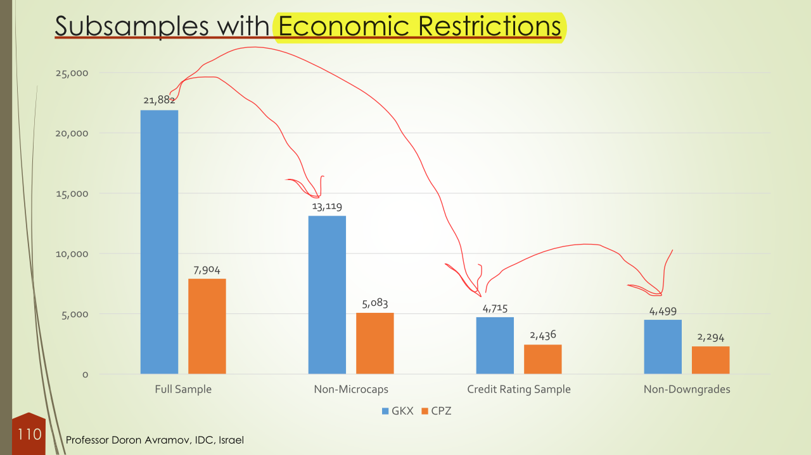

## PAPERS

### GKX 2020 (ML and DP) - Empirical Asset Pricing via Machine Learning - [@GKX2020]

[Presentation at 2018 NYU Stern FinTech Conference on YouTube ](https://youtu.be/5MNQmdIMC1k?t=523)

***

#### METHODOLOGY

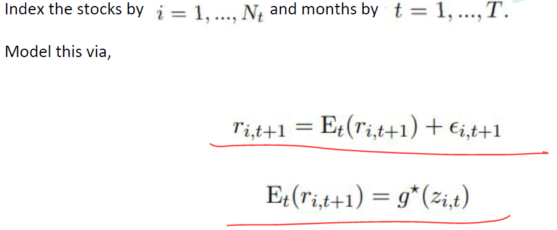

 

---

##### ALTERNATIVE MODELS ESTIMATED

---

#### DATA

[Empirical Data (Updated to June 2021) repository on Dacheng Xiu website](https://dachxiu.chicagobooth.edu/) in the "Empirical Asset Pricing via Machine Learning" section 

---

#### RESULTS

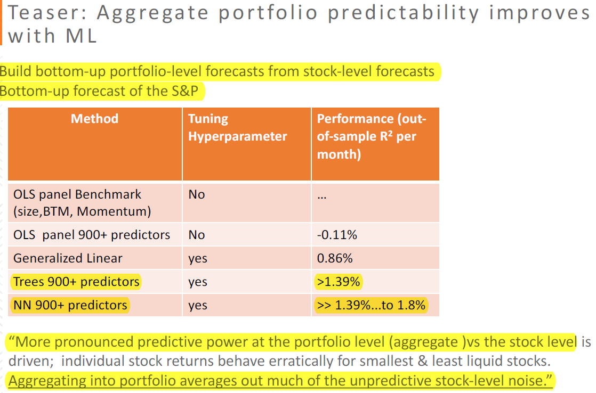

#### 

---

#### LIMITATIONS

***

### CPZ 2019 (GAN) - DEEP LEARNING IN ASSET PRICING - [@CPZ2019]

***

#### METHODOLOGY

***

#### DATA

***

#### RESULTS

***

#### CONCLUSIONS

***

### KPS 2019 IPCA- CHARACTERISTICS ARE COVARIANCES: A UNIFIED MODEL OF RISK AND RETURN - [@IPCA]

***

#### METHODOLOGY

##### ECONOMETRIC MODEL - KPS 2020 [@IPCA_econometrics]

In this section the original model developed in @IPCA_econometrics in 2018 (working paper updated in 2020) is presented. The working paper originally did not have an asset pricing application, which it has been indeed developed in @IPCA.

***

In this section (@IPCA) the theoretical treatment of the IPCA model developed in @IPCA_econometrics in 2018 (later updated in 2020) is illustrated again

***

#### DATA

***

#### RESULTS

***

#### CONCLUSIONS

### GKX 2021 (CONDITIONAL AUTOENCODER) - AUTOENCODER ASSET PRICING MODELS - [@GKX2021]

***

#### METHODOLOGY

***

#### DATA

***

#### RESULTS

***

#### CONCLUSIONS

### KNS 2020 (RIDGE REGRESSION)- SHRINKING THE CROSS-SECTION - [@KNS2020]

***

#### METHODOLOGY

***

#### DATA

***

#### RESULTS

***

#### CONCLUSIONS

***

### DL-SUR - (DL-SUR)

***

### FPX 2020 -DEEP LEARNING IN CHARACTERISTICS-SORTED FACTOR MODELS - [@FPX2020]

***

#### METHODOLOGY

***

#### DATA

***

# DATASETS AND CODESOURCES

### GLOBAL FACTOR DATA (Brian Kelly)

The factor portfolio return data below is for the 153 factors in 93 countries studied in* ["Is There A Replication Crisis In Finance?"](https://papers.ssrn.com/sol3/papers.cfm?abstract_id=3774514)* by Jensen, Kelly, and Pedersen (2021). For researchers with a WRDS license, we provide SAS code to run on WRDS that produces all stock-level signals for a larger collection of 406 characteristics (and the associated factor portfolios) in 93 countries. 

[URL to the page](https://www.bryankellyacademic.org/)

1. [Factor Portfolio Returns](https://www.dropbox.com/sh/ep40dynf2w3lck4/AACYXMDxbGOv21lVK7OC4fq7a?dl=0) (153 characteristic factors in 93 countries, .csv format, 235MB)

2. [Documentation](https://www.dropbox.com/sh/61j1v0sieq9z210/AACdJ68fs5_eT_eJMunwMBWia?dl=0) (.pdf)

3. [Github Code Repository](https://github.com/bkelly-lab/GlobalFactor) (produces 406 stock-level characteristics and associated factor returns in 93 countries)

4. [Request Additional Data](mailto:bryan.kelly@yale.edu?subject=Global Factor Data Request) (email me and describe request)

### DATA FROM EMPIRICAL ASSET PRICING VIA MACHINE LEARNING [@GKX2020]

1. [Empirical Data (Updated to June 2021) repository on Dacheng Xiu website](https://dachxiu.chicagobooth.edu/) in the "Empirical Asset Pricing via Machine Learning" section 

2. [Matlab Simulation Code from Dacheng Xiu Github](https://github.com/xiubooth/ML_Codes)

### AMIT GOYAL'S MACROECONOMIC FACTORS

@WELCH_GOYAL_MACRODATA's dataset containing various macroeconomic factors, available from Amit Goyal's website http://www.hec.unil.ch/agoyal/. The data (Updated up to 2020) are in the section related to the paper [A Comprehensive Look at the Empirical Performance of Equity Premium Prediction](https://drive.google.com/file/d/1uvjBJ9D09T0_sp7kQppWpD-xelJ0KQhc/view?usp=sharing) 

### OTHER

1. Alternative Data sources and description provided by the JPM Big Data and AI Strategies 

   

***

# RESEARCHERS' WEBSITES

1. BRIAN KELLY 
   
- https://www.bryankellyacademic.org/ the page contain mainly papers and only one code and data
  
  
2. DACHENG XIU
   
- https://dachxiu.chicagobooth.edu/ the page contains many papers, scripts, data, slides and supplemental materials
  
     
  
3. AMIT GOYAL

- http://www.hec.unil.ch/agoyal/ the page contains macroeconomic factors data

# GLOSSARY

# REFERENCE

 - Avramov, D., T. Chordia, G. Jostova, and A. Philipov 2013 Anomalies and financial distress. Journal of
Financial Economics 108:139 159
- Avramov, D., S. Cheng, and L. Metzker, 2021 , Machine Learning versus Economics Restrictions: Evidence
from Stock Return Predictability, Working Paper.
- Avramov, D., G. Kaplanski, and A. Subrahmanyam, 2021 , Post Fundamentals Price Drift in Capital Markets:
A Regression Regularization Perspective. Management Science.
- Belloni, Alexandre, Victor Chernozhukov, and Christian Hansen, 2014 , Inference on treatment effects after
selection among high dimensional controls, The Review of Economic Studies 81 , 608 650
- Borisenko, Dmitry., 2019 , Dissecting Momentum: We Need to Go Deeperx Working paper.
- Charpentier, A., Elie R. and Remlinger C., 2020 Reinforcement Learning in Economics and Finance, arXiv
2003.10014 v 1
- Chen, L., M. Pelger, and J. Zhu 2019 Deep learning in asset pricing. Working Paper.
- Chordia, T., A. Subrahmanyam, and Q. Tong 2014 Have capital market anomalies attenuated in the recent
era of high liquidity and trading activity? Journal of Accounting and Economics 58:51 58 .
- Cochrane, John H., 2011 , Presidential Address: Discount Rates, The Journal of Finance 66 , 1047 1108 .
- Cong L. W., Tang K., Wang J., and Zhang Y, 2020 AlphaPortfolio for Investment and Economically
Interpretable AI, working paper
- Feng, Guanhao , Stefano Giglio, and Dacheng Xiu , 2017 , Taming the factor zoo, Working
- Feng, G., S. Giglio, and D. Xiu , 2019 , Taming the factor zoo. Forthcoming in Journal of Finance .
- Feng, Long - SDSC 6001–Statistical Machine Learning, Spring 2020 - School of Data Science, City University of Hong Kong
- Frank, I.E. and Friedman, J.H. ( 1993 ) An Statistical View of Some Chemometrics Regression Tools,
Technometrics 35 , 109 135
- Freyberger, J., A. Neuhierl, and M. Weber 2018 Dissecting characteristics nonparametrically . Working
Paper.
- Fu, Wenjiang J., 1998 , Penalized regressions: the bridge versus the lasso, Journal of computational and
graphical statistics 7 , 397 416
- Gu, S., Kelly, B., Xiu, D., 2019 , Autoencoder Asset Pricing Models, Forthcoming in Journal of
Econometrics.
- Gu , S., B. Kelly, and D. Xiu 2019 Empirical asset pricing via machine learning. Working Paper.
- Harvey, C. R., Y. Liu, and H. Zhu , 2016 , ...and the cross section of expected returns. Review of
Financial Studies 29:5 68 .
- Hoerl , Arthur E., and Robert W. Kennard, 1970 , Ridge regression: Biased estimation for nonorthogonal
problems, Technometrics 12 , 55 67
- Hoerl , Arthur E., and Robert W. Kennard, 1970 , Ridge regression: applications to nonorthogonal
problems, Technometrics 12 , 69 82
- Hou, K., C. Xue , and L. Zhang 2018 Replicating anomalies. Forthcoming in Review of Financial
Studies
Huang, J., J. L. Horowitz, and F. Wei, 2010 , Variable Selection in Nonparametric Additive Models,
Annals of statistics 38 , 2282 2313
- Kelly, B., Pruitt S., and Su Y., 2019 , Characteristics are covariances: a unified model of risk and return,
Forthcoming in Journal of Financial Economics.
- Kelly, B., Pruitt S., and Su Y., 2017 , Instrumental principal component analysis, working papers,
Chicago Booth and ASU WP Carey.
- Kozak, S., S. Nagel, and S. Santosh 2019 Shrinking the cross section. Forthcoming in Journal
of Financial Economics.
- Lettau , M., and M. Pelger. 2018 a. Estimating latent asset pricing factors. Forthcoming in Journal
of Econometrics
- Lettau , M., and M. Pelger. 2018 b. Factors that fit the time series and cross section of stock returns.
Working Paper
- Luyang , Chen., Markus, Pelger ††., and Jason Zhu Zhu, 20192019, Deep Learning in Asset Pricing. Working paper.
144
- McLean, R., and J. Pontiff 20162016, Does academic research destroy stock return predictability? Journal of
Finance 71:5 31
- Nair, Vinod, and Geoffrey E Hinton, 2010 , Rectified linear units improve restricted boltzmann machines,
in Proceedings of the 27 th international conference on machine learning (ICML 10 ), 807 814
- Pástor , Ľuboš , and Robert F. Stambaugh Stambaugh, 20002000, Comparing asset pricing models: An investment
perspective. Journal of Financial Economics 56 3 ): 335 81 .
- Pástor , Ľuboš . 2000 . Portfolio selection and asset pricing models. The Journal of Finance 55 1 ): 179
223
- Stambaugh, R. F., J. Yu, and Y. Yuan 2012 The short of it: Investor sentiment and anomalies. Journal
of Financial Economics 104:288 302 .
- Wang, Jingyuan , Yang Zhang, Ke Tang, Junjie Wu, and Zhang Xiong, 2019 , Alphastock : A buying
winners and selling losers investment strategy using interpretable deep reinforcement attention
networks, in Proceedings of the 25 th ACM SIGKDD International Conference on Knowledge
Discovery & Data Mining pp. 1900 1908 .
- Zou, Hui, and Trevor Hastie, 2005 , Regularization and variable selection via the elastic net, Journal of
the Royal Statistical Society: Series B (Statistical Methodology) 67 , 301 320

# NOTES

to do:

1. data, code, appendix, online appendix, slides, youtube presentation and authors page for:
   1. IPCA
   2. CPZ (GAN)
   3. GKX2021 (CA)
   4. KNS2020
2. include references at the beginning of each series of images:
   1. Feng, G., 2020, Ciy University, Machine Learning in Asset Pricing: Linear Models.

3. 

# BIBLIOGRAPHY